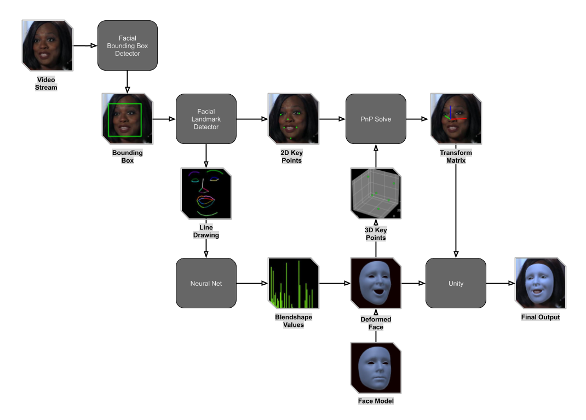

# Facial-Pose-Estimation-OpenCV

This repository is a Visual Studio Project, it contains a `C++` implimentation of Realtime Facial and Headpose Estimation using `OpenCV`, `DLIB` and a `CNN` trained in `Pytorch`.

## About
This is one of three repositories which together form a larger project, these are the three repositories:
- [facial-pose-estimation-pytorch](https://github.com/NeuralVFX/facial-pose-estimation-pytorch)
- [facial-pose-estimation-opencv](https://github.com/NeuralVFX/facial-pose-estimation-opencv) - You are here.
- [facial-pose-estimation-unity](https://github.com/NeuralVFX/facial-pose-estimation-unity)

This blog post describes the whole project: [AR Facial Pose Estimation](http://neuralvfx.com/augmented-reality/ar-facial-pose-estimation/)

## Extra Info
- The output of the Visual Studio Project is a `DLL`
- The DLL outputs the `Transform Matrix`, a set of `Blendshape Values`, and the pixels of the image
- An example of using this `DLL` with `Unity` can be found in this project: [facial-pose-estimation-unity](https://github.com/NeuralVFX/facial-pose-estimation-unity)
- Utilizes a Neural Net from thie project: [facial-pose-estimation-pytorch](https://github.com/NeuralVFX/facial-pose-estimation-pytorch)

## Estimation Pipeline Diagram

## Code Usage
Usage instructions found here: [user manual page](USAGE.md).

