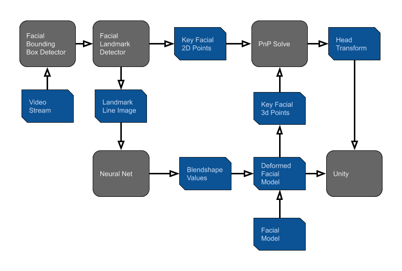

# Facial-Pose-Estimation-OpenCV

This project is a C++ implimentation of realtime facial and headpose tracking using OpenCV and DLIB.

## Interesting Stuff

- The output of the Visual Studio Project is a `DLL`, which can be added to a Unity Project and accessed through C#
- The DLL outputs the transform matrix of the head, a set of blendshapes, and the pixels of the image
- Runs on a live video stream

## Estimation Pipeline Diagram

## Code Usage
Usage instructions found here: [user manual page](USAGE.md).

